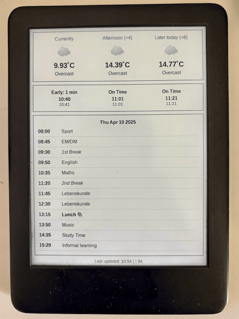

# Kindle Dashboard

A project that transforms your jailbroken Kindle into a customizable dashboard display by fetching and showing images from a server at regular intervals.



## Overview

Turn your jailbroken Kindle into a low powered dashboard. The system works by executing a script (`dash.sh`) that periodically fetches PNG images from a Cloudflare worker and displays it on the Kindle's e-ink screen. I use this to show today's weather, arrival data for the bus stop next door and the day's timetable for my daughter's school. You can use it to display any other information you want to display in a low-power, always-on format.

## Prerequisites

- A jailbroken Kindle device (tested on my old Kindle 10th Gen model)
- Basic knowledge of Linux commands and shell scripting
- Cloudflare worker to host the 
- SSH access to your Kindle
- Image must be 8 bit grayscale in the correct resolution. 
  Find the correct resolution using `eips -i` command on the kindle.


## Installation

### 1. Jailbreak Your Kindle

Jailbreaking the kindle is beyond the scope of this project. The process is documented in an easy format at [Kindle modding](https://kindlemodding.org/).

> ⚠️ **Warning**: Jailbreaking your Kindle may void your warranty. Proceed at your own risk.

Kindle hacking is a very active community. For advanced topics, refer to [MobileRead Wiki](https://wiki.mobileread.com/wiki/Kindle_Hacks_Information) or the discord server.

### 2. Set Up the Script

1. SSH into your Kindle:
   ```bash
   ssh root@kindle-ip-address
   ```

2. Create a directory for the dashboard:
   ```bash
   mkdir -p /mnt/us/dashboard
   ```

3. Copy the contents of this folder to the dashboard directory:
   ```bash
   scp -r ./ root@kindle-ip-address:/mnt/us/dashboard/
   ```

4. Make the script executable:
   ```bash
   chmod +x /mnt/us/dashboard/*.sh
   ```

5. Change the variables in `local/env.sh`

6. Start the script:
   ```bash
   ./start.sh
   ```
7. Stop the script using `stop.sh`.

8. You can also set it up as a startup process using `upstart` or as a KUAL script. This is beyond the scope of this project.

9. Optional: Test your image using the script `start-test.sh`.


## Troubleshooting

### Screen Not Updating

Check the following:
- Ensure the script is running (check process list with `ps aux | grep dash.sh`)
- Check logs in `./logs/dash.log`
- Verify the image file exists and is in 8 bit grayscale mode.
- Check if your server is accessible from the Kindle

### Return to Normal Kindle Usage

If you need to return to normal Kindle usage:
1. SSH into your Kindle
2. Kill the dashboard script: `killall dash.sh`
3. Restart the Kindle: `reboot`


## License

This project is licensed under the MIT License - see the LICENSE file for details.

## Acknowledgments

- The Kindle jailbreak community for making projects like this possible
- [Hemant @ Terminal bytes](https://github.com/terminalbytes/kindle-dashboard)
- [Pascalw](https://github.com/pascalw/kindle-dash) and his Kindle Dash project

